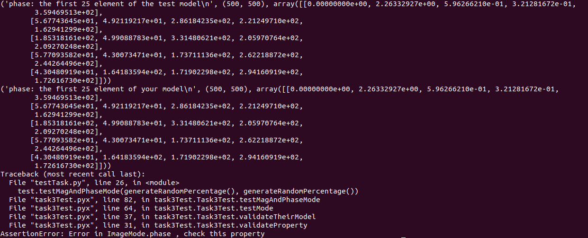
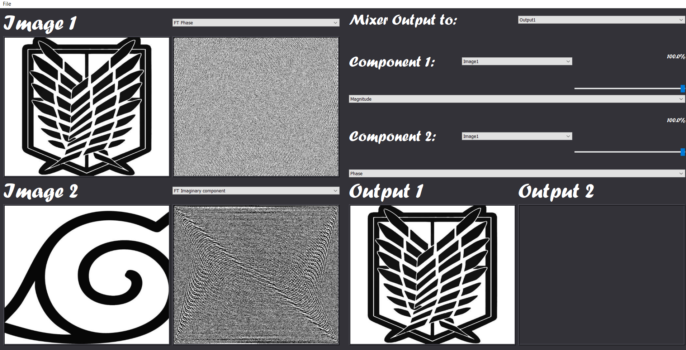
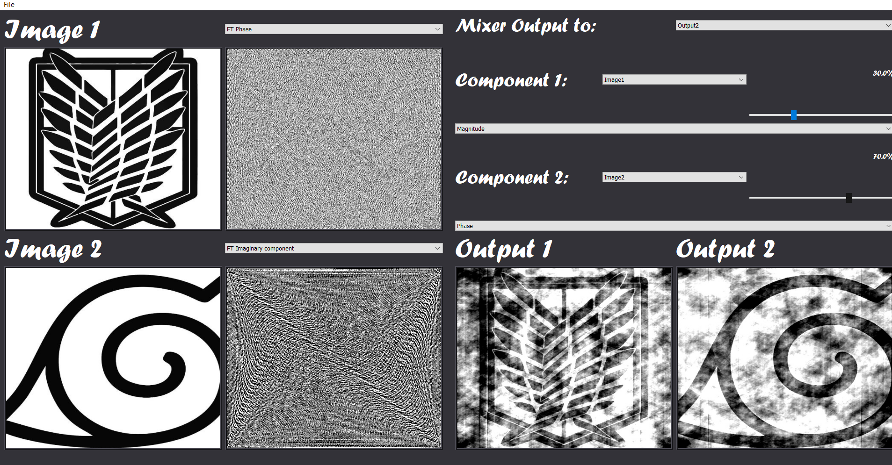
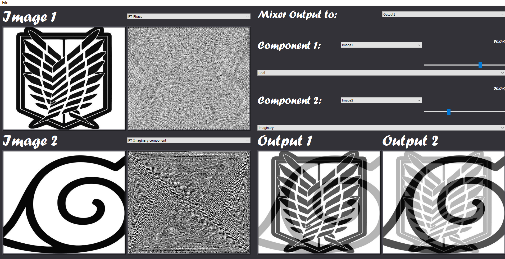
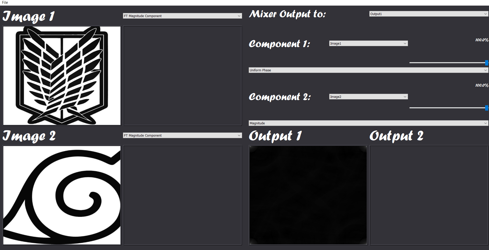

## Write your name and ID
### Name: Alaa Gamal Abdelaziz
### Sec: 1
### BN: 15

## Testing Problems:
*OS: Linux*

*Python Version: 3.7*

*The first error occurred with the files inside the Linux folder, and the second occurred when i put them in the same folder as testTask.py*

## My GUI Screenshots:
 
 
 
 
 
 
